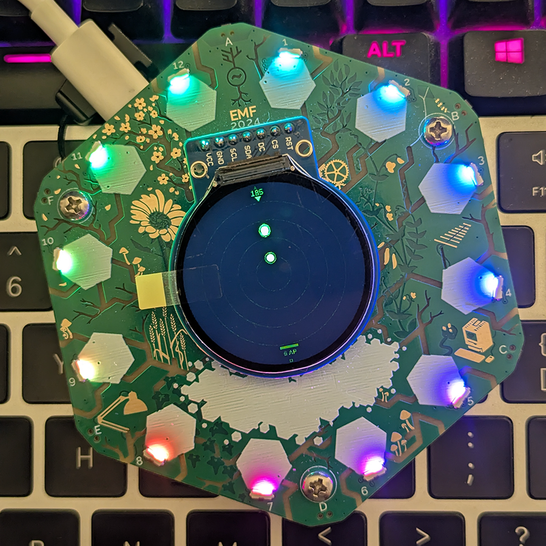

# Tildagon WiFi Radar

Directional WiFi radar and ESP-NOW mesh mapper for the [Tildagon badge](https://tildagon.badge.emfcamp.org/) at EMF Camp. Two modes: rotate the badge to sweep for nearby access points, or switch to mesh mode to see other badges around you as a live relational map.



## Features

- **Polar radar display** &mdash; scrolling sweep driven by the onboard IMU gyroscope
- **Live WiFi scanning** &mdash; captures nearby access points with RSSI, stamped to your current heading
- **Logarithmic distance mapping** &mdash; RSSI converted to estimated range via path-loss model
- **Persistent blips** &mdash; APs accumulate on the display and fade over time
- **Three colour themes** &mdash; green, blue, and amber radar styles
- **ESP-NOW mesh mode** &mdash; badges discover each other and exchange pairwise RSSI over ESP-NOW broadcasts
- **RSSI distance estimation** &mdash; each direct link RSSI is converted to metres using the same log path-loss model as AP mode
- **Relational map triangulation** &mdash; pairwise distances between all known peers are fed into a spring-force solver that relaxes node positions into a consistent 2D layout, with your badge pinned at the centre
- **Credits screen** &mdash; Web Order logo with IMU-driven parallax

## How the mesh works

Each badge running the app periodically broadcasts an ESP-NOW packet containing its own MAC and the RSSI it observes for every direct neighbour. Any badge that receives the packet adds the sender&rsquo;s observations to its graph.

Distance between two nodes is estimated as:

```
d = 10 ^ ((TX_POWER - RSSI) / (10 * PATH_LOSS_N))
```

where `TX_POWER` is &minus;40&nbsp;dBm and `PATH_LOSS_N` is 2.8 (indoor free-space approximation).

The spring-force solver treats each known pairwise distance as a rest-length spring. On each frame it iterates the node positions, applying an attractive spring force toward the target distance and a mild repulsion between all node pairs to prevent overlap. After convergence the layout is projected onto the radar ring using a log-scale so close nodes don&rsquo;t crowd the centre.

## Controls

| Button | Action |
|--------|--------|
| A (UP) | Cycle colour theme |
| C (CONFIRM) | Toggle AP&nbsp;/&nbsp;Mesh mode |
| D (DOWN) | Credits screen |
| F (CANCEL) | Exit app&nbsp;/&nbsp;back from credits |
| IMU (rotate) | Sweep radar heading |

## Install

### From the app store

Search **WiFi Radar** in the [Tildagon App Store](https://apps.badge.emfcamp.org/).

### Manual install via mpremote

```
mpremote mkdir apps/tildagon_wifi_radar
mpremote cp app.py :apps/tildagon_wifi_radar/app.py
mpremote cp mesh.py :apps/tildagon_wifi_radar/mesh.py
mpremote cp logo.png :apps/tildagon_wifi_radar/logo.png
mpremote cp tildagon.toml :apps/tildagon_wifi_radar/tildagon.toml
```

Hold the **reboop** button for 2 seconds to restart, then select WiFi Radar from the menu.

## Credits

[@webboggles](https://github.com/webboggles) &mdash; [weborder.uk](https://weborder.uk)

## Licence

MIT
